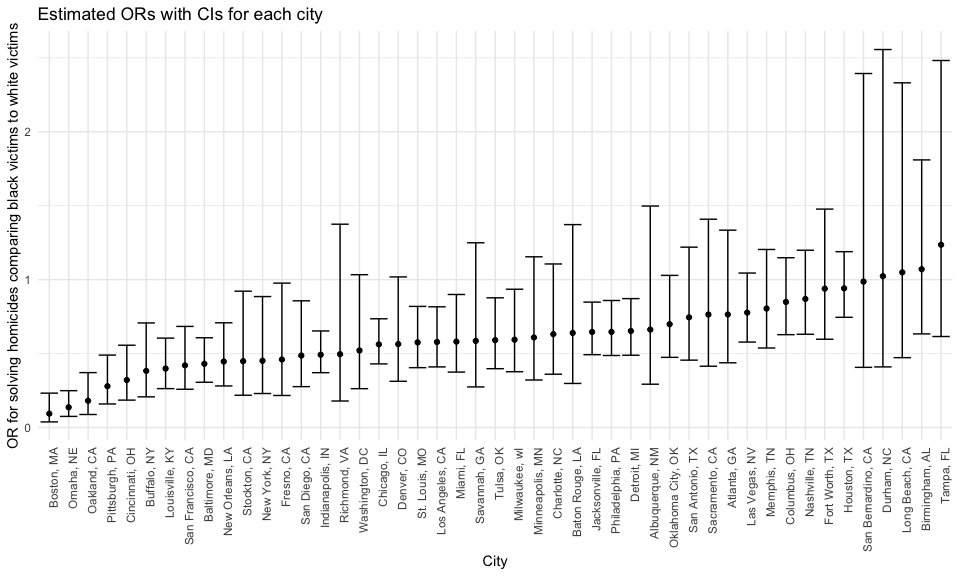
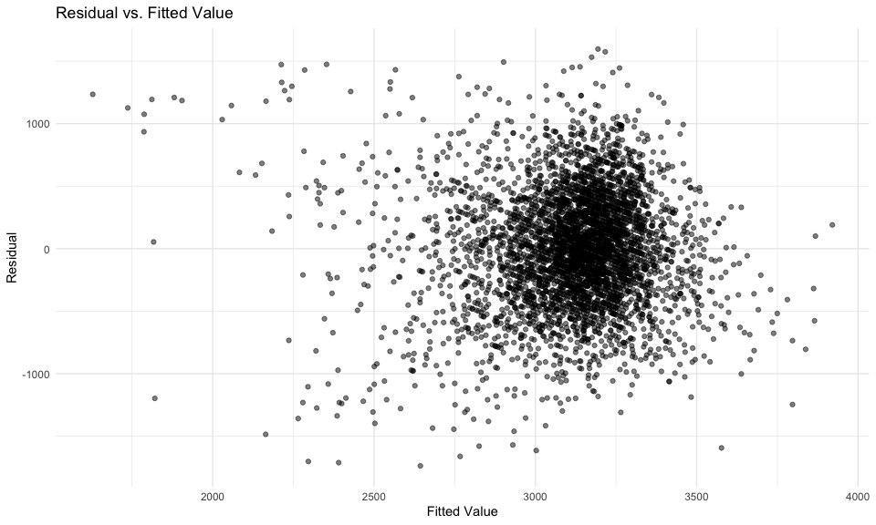
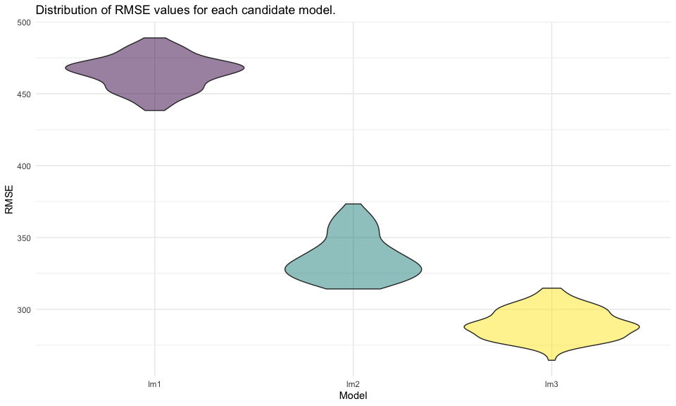

HW6
================
Yi Sun

Solution to HW6.

## Problem 1

Prepare the data.

``` r
homicide_df = 
  read_csv("data/homicide-data.csv", na = c("", "NA", "Unknown")) %>% 
  mutate(
    city_state = str_c(city, state, sep = ", "),
    victim_age = as.numeric(victim_age),
    resolution = case_when(
      disposition == "Closed without arrest" ~ 0,
      disposition == "Open/No arrest"        ~ 0,
      disposition == "Closed by arrest"      ~ 1
    )
  ) %>% 
  filter(
    victim_race %in% c("White", "Black"),
    !(city_state %in% c("Tulsa, AL", "Dallas, TX", "Phoenix, AZ", "Kansas City, MO"))
  ) %>% 
  select(city_state, resolution, victim_age, victim_race, victim_sex)
```

For the city of Baltimore, MD, fit a logistic regression with resolved
vs unresolved as the outcome and victim age, sex and race as
predictors.  
Save the output of glm as an R object; apply the broom::tidy to this
object; and obtain the estimate and confidence interval of the adjusted
**odds ratio** for solving homicides comparing non-white victims to
white victims keeping all other variables fixed.

``` r
baltimore_df =
  homicide_df %>% 
  filter(city_state == "Baltimore, MD") %>% 
  mutate(victim_race = fct_relevel(victim_race, "White", "Black"))

baltimore_results = 
  glm(
    resolution ~ victim_age + victim_race + victim_sex, 
    data = baltimore_df,
    family = binomial()
  ) %>% 
  broom::tidy() %>% 
  mutate(
    odds_ratio = exp(estimate),
    CI_lower = exp(estimate - 1.96 * std.error),
    CI_upper = exp(estimate + 1.96 * std.error)
  ) %>% 
  select(term, odds_ratio, starts_with("CI")) %>% 
  filter(term == "victim_raceBlack") %>% 
  knitr::kable(digits = 3)

baltimore_results
```

| term              | odds\_ratio | CI\_lower | CI\_upper |
| :---------------- | ----------: | --------: | --------: |
| victim\_raceBlack |       0.431 |     0.306 |     0.607 |

Run glm for each of the cities in the dataset, and extract the adjusted
odds ratio (and CI) for solving homicides comparing black victims to
white victims.

``` r
cities_results_df = 
  homicide_df %>% 
  mutate(victim_race = fct_relevel(victim_race, "White", "Black")) %>% 
  nest(data = -city_state) %>% 
  mutate(
    models = 
      map(.x = data, ~glm(resolution ~ victim_age + victim_race + victim_sex, data = .x, family = binomial())), 
    results = map(models, broom::tidy)
  ) %>% 
  select(city_state, results) %>% 
  unnest(results) %>% 
  mutate(
    odds_ratio_black = exp(estimate),
    CI_lower = exp(estimate - 1.96 * std.error),
    CI_upper = exp(estimate + 1.96 * std.error)
  ) %>% 
  filter(term == "victim_raceBlack") %>% 
  select(city_state, odds_ratio_black, starts_with("CI"))
```

Create a plot that shows the estimated ORs and CIs for each city.
Organize cities according to estimated OR.

``` r
odds_ratio_city_plot = 
  cities_results_df %>% 
  mutate(city_state = fct_reorder(city_state, odds_ratio_black)) %>% 
  ggplot(aes(x = city_state, y = odds_ratio_black)) + 
  geom_point() + 
  geom_errorbar(aes(ymin = CI_lower, ymax = CI_upper)) + 
  labs(
    y = "OR for solving homicides comparing black victims to white victims",
    x = "City",
    title = "Estimated ORs with CIs for each city"
  ) +
  theme(axis.text.x = element_text(angle = 90, hjust = 1))

odds_ratio_city_plot
```



From the above plot, we can see that the estimated OR for solving
homicides comparing black victims to white victims for most cities in
our prepared dataset was below the null value 1, and none of these ORs
could be concluded to be statistically significantly greater than 1,
while many of them were statistically significantly smaller than 1, at a
significance level of 0.05.

## Problem 2

Load and clean the data for regression analysis.

``` r
birthweight_df = 
  read_csv("./data/birthweight.csv") %>% 
  mutate(
    babysex = as.factor(babysex),
    frace = as.factor(frace),
    malform = as.factor(malform),
    mrace = as.factor(mrace)
  )

birthweight_df %>% 
  anyNA()
```

    ## [1] FALSE

The dataset doesn’t seem to contain any missing values.

First, propose my regression model for birth weight. (Model 1)  
Based on my knowledge and results from Google, gestational age, mother’s
age at delivery, and parity are three determinants of birth weight.
Therefore, I decided to fit a linear regression model for birth weight
using gestational age in weeks (`gaweeks`), mother’s age at delivery in
years (`momage`) and number of live births prior to this pregnancy
(`parity`) as predictors.

``` r
birthweight_lm1 = 
  lm(bwt ~ gaweeks + momage + parity, data = birthweight_df)
```

Second, make a plot of model residuals against fitted values.

``` r
residuals_fitted = 
  birthweight_df %>% 
  add_residuals(birthweight_lm1) %>% 
  add_predictions(birthweight_lm1) %>% 
  select(resid, pred) %>% 
  ggplot(aes(x = pred, y = resid)) +
  geom_point(alpha = 0.5) +
  labs(
    x = "Fitted Value",
    y = "Residual",
    title = "Residual vs. Fitted Value"
  )

residuals_fitted
```



Third, compare my model to two other models by :

  - One using length at birth and gestational age as predictors (main
    effects only) (Model 2)
  - One using head circumference, length, sex, and all interactions
    (including the three-way interaction) between these (Model 3)

<!-- end list -->

``` r
cross_validation_df = 
  crossv_mc(birthweight_df, 100) %>% 
  mutate(
    train = map(train, as_tibble),
    test = map(test, as_tibble)
  ) %>% 
  mutate(
    lm1 = map(.x = train, ~lm(bwt ~ gaweeks + momage + parity, data = .x)),
    lm2 = map(.x = train, ~lm(bwt ~ blength + gaweeks, data = .x)),
    lm3 = map(.x = train, ~lm(bwt ~ bhead * blength * babysex, data = .x)),
  ) %>% 
  mutate(
    rmse_lm1 = map2_dbl(.x = lm1, .y = test, ~rmse(model = .x, data = .y)),
    rmse_lm2 = map2_dbl(.x = lm2, .y = test, ~rmse(model = .x, data = .y)),
    rmse_lm3 = map2_dbl(.x = lm3, .y = test, ~rmse(model = .x, data = .y))
  )

rmse_dist = 
  cross_validation_df %>% 
  select(starts_with("rmse")) %>% 
  pivot_longer(
    everything(),
    names_to = "model", 
    values_to = "rmse",
    names_prefix = "rmse_"
  ) %>% 
  ggplot(aes(x = model, y = rmse, fill = model)) +
  geom_violin(alpha = 0.5) +
  labs(
    x = "Model",
    y = "RMSE",
    title = "Distribution of RMSE values for each candidate model."
  )

rmse_dist
```



According to the distribution of RMSE values for each candidate model,
in general, Model 3 has the smallest RMSE, followed by Model 2, and my
model has the greatest RMSE. This indicates that Model 3 may be the best
model while my model may be the worst model for prediction of birth
weight among these 3 models.
